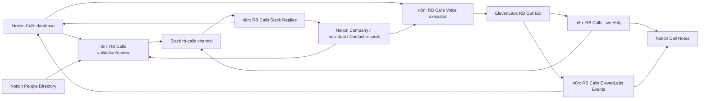

# RB Calling Bot Implementation Map

Status: provisional.
Source: user instruction on 2026-05-08, 2026-05-11, and 2026-05-12; Notion project/spec/database fetches on 2026-05-08; n8n MCP fetches and updates on 2026-05-08, 2026-05-11, and 2026-05-12; ElevenLabs MCP reads and direct API updates on 2026-05-08, 2026-05-11, and 2026-05-12; user-provided ElevenLabs agent URL; Internal Knowledge Base mirror at `https://www.notion.so/35ae413013148138a0d1e116249cce84`.
Imported: 2026-05-08.
Review: run a post-fix controlled retry, reconfirm the n8n ElevenLabs HTTP credential after the latest MCP update, confirm Slack app interactivity settings, confirm legal/consent rules for automated authority calls, and test with non-client data before production use.

This file maps the current Richmond Blackwood authority-calling bot build. It intentionally excludes live credentials, Slack channel IDs, phone numbers, webhook secrets, call recordings, transcripts, and full n8n payload dumps.

## Source Links

- n8n workflow: `RB Calls` - `https://eipventures.app.n8n.cloud/workflow/CBS5BbsyaS7XuXz7`
- n8n workflow: `RB Calls Slack Replies` - `https://eipventures.app.n8n.cloud/workflow/ShlONuiSoBz9eqGu`
- ElevenLabs agent: `agent_2001kq39ea0hf5yb86c4a7hj9gp1` - `https://elevenlabs.io/app/agents/agents/agent_2001kq39ea0hf5yb86c4a7hj9gp1?tab=workflow`
- Notion project: `Authority Liasion Bot` - `https://www.notion.so/34ce4130131480adbf76f90e5fad640f`
- Notion automation task: `Automated calling bot for calling authorities` - `https://www.notion.so/342e41301314805182abd4cf946f5932`
- Notion operational hub: `Call Outbound Bot` - `https://www.notion.so/32ee4130131480c7bf8cdbfee78eefbf`
- Notion Calls database: `https://www.notion.so/342e413013148012964ad969a860dd93`
- Notion Call Notes database: `https://www.notion.so/342e4130131480168cedd60cbf9fe9bf`
- Notion Front Office Contacts database: `https://www.notion.so/2d8e41301314806a98ced03ff9c3cae2`
- Notion Contact Availabilities database: `https://www.notion.so/342e41301314801f8983f9954c3ddb29`
- Internal Knowledge Base mirror: `https://www.notion.so/35ae413013148138a0d1e116249cce84`

## Current Architecture

Implementation state as of 2026-05-12:

- Original n8n validation/review workflows still exist and should remain separate from voice execution.
- New voice execution, live help, and ElevenLabs event workflows are active in n8n as of the 2026-05-11 readback and exposed to MCP.
- The ElevenLabs agent now has `request_creator_help` and `check_creator_help` webhook tools attached, the main workflow graph rebuilt into explicit authority-call stages, an explicit IVR/menu-navigation stage, and a post-call webhook configured.
- A 2026-05-11 live-start failure exposed that ElevenLabs validates every tool dynamic variable against both the agent-level dynamic-variable registry and the outbound-call dynamic-variable payload before starting a conversation. The agent-level placeholders have now been patched to include `call_id`, `call_public_id`, `linked_context_json`, and all live-help tracking variables, and `RB Calls Voice Execution` now initializes the live-help variables in `Build Voice Payload`.
- `RB Calls Voice Execution` now preflights relations before dereferencing, resolves the call owner through the Notion People Directory, claims and verifies a best-effort Notion lock before dialing, initializes the required live-help dynamic-variable sentinels, and normalizes ElevenLabs outbound-call responses before writing Notion status/IDs.
- `RB Calls Voice Execution` active version `239b8ddf-4528-44dc-945d-2646ad49fa85` now keeps ElevenLabs startup context small and plain text: direct Company/Individual/Contact summaries, tax registration/reference context, owner/routing metadata, representative identity variables, live-help sentinels, and a public-safe voice `context_pack`. Detailed non-startup records for tax filings, contracts, correspondence, bank accounts, tax payments/prepayments, assets, and call notes are fetched during the call through `RB Calls Context Lookup`. n8n preserves raw identifiers only and reinforces that they must be spoken much, much slower with pauses and breaks; pronunciation remains controlled by the ElevenLabs prompt. File fields are not sent as file names, URLs, or content; only metadata such as file-property counts may be retained for coverage checks. The lock claim step clears stale `ElevenLabs Conversation ID` and `Twilio Call SID` before a new outbound attempt so a canceled n8n execution cannot leave the call pointing at an old conversation. The voice-payload builder reads upstream nodes through raw `$items(...)` access rather than paired-item ancestry from `Build Linked Record Queue`.
- Slack is now reserved for cases where the bot actually needs human input. `RB Calls Live Help` posts exactly one structured help thread for a live call question; `RB Calls Voice Execution` and `RB Calls ElevenLabs Events` record starts, blockers, post-call events, no-answer sweeps, and other state changes in Notion only.
- `RB Calls Live Help` active version `fcb18f19-a561-4ed7-9d00-4bb7a07cb195` now validates malformed tool calls, posts exactly one structured help thread, renders ElevenLabs transcript history into readable speaker lines, accepts `answer:` replies, normalizes Slack owner mentions that include display-name pipes, recovers the owner from the parent help message, accepts the newest plain owner/approved-user reply such as a reference number, recovers the Slack help thread from recent channel history when ElevenLabs sends a missing/placeholder `slack_thread_ts`, and throttles pending responses with a 30-second n8n wait. The 2026-05-12 reply-pickup bug was caused by an escaped Slack timestamp regex being saved as `^d{10}.d{6}$`; the workflow now uses a backslash-free `[0-9]` timestamp pattern.
- `RB Calls ElevenLabs Events` active version `5dc3c54d-a370-4445-8298-22aff0f5b5c2` includes a one-minute no-answer watchdog. Started calls older than two minutes with zero messages and no pickup are moved to `Call Unanswered` and get a Call Note without posting Slack status noise, including ElevenLabs states `initiated` and `in-progress` when duration remains zero. Claim-only locks with no stored conversation ID are treated as stale after two minutes and swept to follow-up, which covers canceled/manual n8n executions after lock claim. The conversation status check uses n8n variable `ELEVENLABS_API_KEY`, not a fragile HTTP Request credential.
- The ElevenLabs agent workflow was cleaned up and then updated for concrete lookup-first escalation and corrected live-help hold timing on 2026-05-12. The old tool IDs `tool_0001kqfd5skhfn3vnpww2s6fnt6r` and `tool_5801krbamtebe6zvs5qfa023x9eh` are superseded/deleted and have zero live references in readback. Active prompt version `agtvrsn_8901krf5eycjekkspw9sfk2ywm4e` has no custom root `tool_ids`; `lookup_call_context` (`tool_4501kremgshnej7rtqftyxxgd3jb`) is routed through dedicated workflow tool node `node_rb_lookup_tool_v1` and result handler `node_rb_lookup_result_v1`; `request_creator_help` (`tool_0701krd392jge1z9q058dvh25kn7`) is attached only to workflow tool node `node_rb_live_start_v2`; and `check_creator_help` (`tool_7901krd392jhefv9x4btx1jmxfdb`) is attached only to workflow tool node `node_rb_live_check_v2`.
- The active agent opening rule is startup-safe and language-aware: the default English first audible message is static and contains no dynamic placeholders, German calls use the German ElevenLabs language-preset first message, and n8n selects the actual call language through the outbound API override. The first substantive response after the contact answers should identify Alexander Gulin and the represented Company/Individual; Richmond Blackwood Limited is not mentioned before the represented subject is clear. For company calls, Richmond Blackwood Limited is introduced after that as the company secretary, which is the representative position; PoA/Vollmacht is a fallback only when the call is marked as requiring it or the authority insists.
- `RBCALL-11` was unlocked on 2026-05-12 after manual n8n execution `3632` was canceled after lock claim. The record is `Reviewed` with `Approved` unchecked, stale conversation/call IDs cleared, and a `Voice Error` note explaining that re-approval is required for the next controlled retry.
- The immediate safety control is call-level gating in Notion: keep test or production calls unapproved until ready. The remaining live-call blockers are completing the post-fix controlled retry, running the full synthetic test plan, and approving legal/privacy/retention rules before any production client use.

## Slack Message Standard

Status: provisional.
Source: user correction on 2026-05-11; n8n MCP updates and readbacks for `RB Calls Voice Execution`, `RB Calls Live Help`, and `RB Calls ElevenLabs Events`.
Imported: 2026-05-11.
Review: verify with real Slack posts during the controlled retry; pinned tests only verified generated message text.

Slack posting policy for the calling-bot workflows:

- Do not post routine call lifecycle, call-start, call-end, no-answer sweep, blocked/preflight, or status-change messages to Slack.
- Post to Slack only when a live call needs a human answer or action.
- Live-help posts use first line `[<call_public_id>] [live-help] Owner: <@owner_slack_member_id>` when an owner is known.
- Live-help posts include `Topic:`, `Call:`, `ElevenLabs conversation:`, `Help request ID:`, the agent question, and a readable transcript excerpt.
- Live-help Slack messages must not dump raw ElevenLabs JSON. Transcript history should be converted into readable speaker lines and truncated before posting.

Current calling-bot Slack topic tags:

- `[live-help]`

## n8n Workflow: RB Calls

Status: provisional.
Source: n8n MCP `get_workflow_details`, workflow `CBS5BbsyaS7XuXz7`.
Imported: 2026-05-08.
Review: active workflow; legacy validation/review path still has known defects and should be fixed before relying on it for production gating.

Workflow state:

- Name: `RB Calls`.
- ID: `CBS5BbsyaS7XuXz7`.
- Active: yes.
- Available in MCP: yes.
- Trigger count: 1.
- Current trigger: schedule trigger named `Every 30 minutes`.
- Node count: 54.
- Updated: 2026-05-08T17:02:36.696Z.

What it currently does:

1. Runs every 30 minutes.
2. Queries the Notion `Calls` database for calls where `Call Status` is not `Call Completed` and not `Call Retry Failed`.
3. Loops over each call.
4. Switches on `Call Status`: `Not started`, `Reviewing`, `Reviewed`, and `Rejected`.
5. For `Not started`, sets the call to `Reviewing`, fetches Individual, Company, Contact, and Submitter, validates that the Individual appears to belong to the Company, checks PoA, and requests Slack review where appropriate.
6. For invalid Individual/Company relation, sets call status to `Rejected` and sends a Slack message asking the submitter to fix the Company/Individual relation.
7. For missing PoA, sets call status to `Rejected` and sends a Slack message asking for PoA or removal of the PoA requirement.
8. For `Reviewing`, checks whether the `Approved` checkbox is true. If approved, sets `Call Status` to `Reviewed`; otherwise sends or reminds Slack review request.
9. For `Rejected`, re-runs validation and either asks/reminds for fixes or moves the call back into review.

Important implementation details:

- Slack messages use marker tags such as `[call-invalid]`, `[poa-invalid]`, and `[call-approval]`.
- Slack searches are used to avoid duplicate notifications and to send reminders only if the latest thread message is over one day old.
- Reviewer and submitter Slack IDs are fetched through a Notion `People Directory` database by matching Notion person names to `Full Name`.
- Current status transitions are limited to validation/review statuses: `Not started`, `Reviewing`, `Rejected`, and `Reviewed`.

Observed gaps and likely defects:

- The workflow is active as of the 2026-05-11 n8n MCP readback.
- There is no ElevenLabs node or HTTP Request to trigger an outbound call.
- There is no post-call webhook, transcript capture, or Call Notes creation.
- The `Reviewed` switch branch has no outgoing connection, so approved calls stop there.
- The node `If (PoA Required AND Missing) OR (PoA not required)` still references `Loop Over Not Started Calls`, which does not exist; this is the source of the earlier n8n runtime error and should be corrected to the current loop node before production reliance.
- The workflow does not currently filter by `First call date`, contact availability windows, business hours, retry timing, or "picked up not more than once per day" rules.
- The workflow assumes `Company`, `Individual`, `Contact`, `Submitter`, and `Reviewer` are present and uses relation/person array index `0`; missing data will likely throw instead of producing a controlled blocker message.
- The project spec says Company is optional, but this workflow treats Company as required.
- The Individual/Company relation check uses `JSON.stringify(company.properties).includes(individualId)`, which is brittle.
- The PoA check uses `Individual PoA.files.length > 1`; that likely requires two files, not one. If a single valid PoA is enough, this should be `> 0`.
- The workflow marks PoA as validated when the presence check passes, but there is no separate human/legal validation step.
- Some expressions/action IDs fetched from n8n include invisible Unicode formatting characters before `{{ ... }}` or action values. These should be removed because they can make comparisons fail.

## n8n Workflow: RB Calls Slack Replies

Status: provisional.
Source: n8n MCP `get_workflow_details`, workflow `ShlONuiSoBz9eqGu`.
Imported: 2026-05-08.
Review: active workflow; file-upload branch still needs a controlled test before production reliance.

Workflow state:

- Name: `RB Calls Slack Replies`.
- ID: `ShlONuiSoBz9eqGu`.
- Active: yes.
- Available in MCP: yes.
- Trigger count: 2.
- Current triggers:
  - Slack trigger listening to any event in the RB calls channel.
  - Webhook named `Interactivity Webhook` for Slack interactivity payloads.
- Node count: 17 in the current draft.
- Updated: 2026-05-08T17:02:45.621Z.

What it currently does:

1. Accepts Slack interactive payloads through a webhook and parses `body.payload` JSON.
2. Also listens to Slack events in the calls channel.
3. Switches on Slack action/file inputs: `remove-poa`, `approve-call`, and file upload in a thread.
4. `remove-poa` updates the Notion call page: `Call Status` -> `Not started`, `Requires PoA?` -> unchecked, then adds a white-check Slack reaction.
5. `approve-call` updates the Notion call page: `Approved` -> checked, `Call Status` -> `Reviewed`, then adds a white-check Slack reaction.
6. File uploads are handled when the parent thread contains `[poa-invalid]`: extract call ID, fetch call by unique ID, create Notion file upload URL, download Slack file, upload it to Notion, patch the linked Individual page's `Individual PoA` file property, and mark Slack handled.

Observed gaps and likely defects:

- The workflow is active and n8n readback shows the current version is the active version as of 2026-05-11.
- Slack interactivity must be pointed at the `Interactivity Webhook` production URL in the Slack app. The workflow alone is not sufficient.
- The file-upload branch assumes the first file on the Slack event is the PoA and does not validate file type, filename, submitter, or call/individual match.
- The `Get Call ID` code parses the first bracketed token from Slack thread text. This is fragile if the message format changes.
- The current draft uses Notion's file upload API, but the `Get Notion Upload URL` HTTP body appears empty in the n8n definition. Confirm the Notion API requirements and test upload.
- Like `RB Calls`, the switch expressions include invisible Unicode formatting characters around some action IDs/expressions. Remove them before testing.

## ElevenLabs Agent

Status: accessible through ElevenLabs MCP for read-only agent, phone-number, and conversation checks; updated through direct ElevenLabs API after user approval because MCP lacks tool/agent update actions.
Source: user-provided URL, ElevenLabs MCP reads, and direct ElevenLabs API checks/updates using the local config key on 2026-05-08, 2026-05-11, and 2026-05-12.
Imported: 2026-05-08.
Review: verify the user-configured phone-number/runtime setup and confirm privacy/retention settings before live client calls.

Known:

- Agent ID from URL: `agent_2001kq39ea0hf5yb86c4a7hj9gp1`.
- Agent name: `RB Call Bot`.
- Agent language: API-controlled per call. n8n sends `conversation_initiation_client_data.conversation_config_override.agent.language` as `de` for German contacts and `en` otherwise, while also sending prompt variables `language` and `language_code`.
- LLM: `claude-haiku-4-5`.
- First message: default English opener is `Hello, my name is Alexander Gulin. I am calling regarding an administrative matter for a client and would like to make sure I am speaking with the right department.` German calls use the German ElevenLabs language-preset opener.
- Startup safety: direct/manual ElevenLabs calls can start without n8n dynamic variables, so the literal first message contains no `{{...}}` placeholders. Agent-level dynamic-variable placeholders now include safe defaults for the n8n call variables, live-help tracking variables, and full-context JSON variables.
- Max conversation duration: 1,200 seconds.
- Prompt role: professional caller contacting authorities, tax offices, insurers, banks, registries, and similar offices on a client's behalf.
- Prompt now includes the five-minute live-help loop in 30-second hold/check mode: start once, say one short hold phrase if needed, keep the contact on the line, run pending checks only after 30-second n8n-delayed responses, never say "still checking" / "still here" / tool status values aloud, avoid duplicate Slack requests, and fall back conservatively only after explicit timeout/read-error or if the contact refuses to keep holding. Placeholder expiry values such as `1970-01-01T00:00:00.000Z` are ignored by n8n.
- Prompt now includes a public disclosure boundary: dynamic variables, context packs, relation maps, Notion records, Slack/help state, workflow state, tool names, file names, database names, field names, internal statuses, and source labels are private operator notes and must not be said to the person on the phone.
- Prompt now includes conversation-continuity rules so the agent should not end the call while the contact is still asking for a tax number, identifier, route, deadline, document requirement, callback, or clarification.
- Prompt now includes pronunciation rules to spell common abbreviations letter-by-letter in the current call language, including V-A-T, P-O-A, U-B-O, R-B-O, E-O-R-I, P-P-S-N, U-T-R, T-A-I-N, R-O-S, H-M-R-C, C-R-O, I-D, and R-B.
- Prompt now includes `Pronunciation And Spelling`, `Identifier Pronunciation - Prompt Controlled`, and `Slow Number Delivery - Hard Rule`: n8n sends raw identifiers only; the agent must preserve exact raw values while saying numbers, registration numbers, tax references, phone numbers, and alphanumeric strings much, much slower than normal speech in the current call language. English calls use English digit and letter names. German calls must use German digit words (`null`, `eins`, `zwei`, `drei`, `vier`, `fünf`, `sechs`, `sieben`, `acht`, `neun`) and German letter names, and must not use English digit words or NATO words such as `Delta`, `Echo`, `Oscar`, or `Hotel` unless the authority explicitly asks. Important identifiers use a language-appropriate preface such as "I'll say that slowly" or "Ich sage das langsam", clear pauses between chunks, two- or three-digit groups at most, letter-by-letter spelling, and slower repeats if asked.
- Workflow graph: 17 nodes, 42 edges, `prevent_subagent_loops` enabled.
- Routing now visibly returns to `Main Authority Conversation` through `4b. Continue via Correct Route` when the correct department, person, transfer, portal path, callback route, document-submission route, or channel allows the substantive call to continue. Routing goes to `Outcome Capture & Confirmation` only when routing/callback/document-submission details are the final usable outcome.
- Workflow canvas layout was widened on 2026-05-11 to separate the main call path, authority/manual fallback branch, live-help loop, routing branch, IVR/menu branch, and voicemail/no-human branch into distinct lanes.
- Voice ID: `7EzWGsX10sAS4c9m9cPf`.
- TTS model: `eleven_multilingual_v2`.
- Native turn/pacing settings: `turn_timeout: 30`, `turn_eagerness: patient`, `tts.speed: 1.0`, and global background music disabled. Hold-only audio still needs a safer implementation after startup stability is confirmed.
- ASR provider/quality: `scribe_realtime`, high quality.
- Current custom tools:
  - `lookup_call_context` (`tool_4501kremgshnej7rtqftyxxgd3jb`): calls the n8n context-lookup webhook for approved Notion categories, runs in immediate execution mode with interruptions disabled, and is routed through dedicated workflow node `node_rb_lookup_tool_v1`.
  - `request_creator_help` (`tool_0701krd392jge1z9q058dvh25kn7`): calls the n8n live-help webhook with `action: start`, posts one Slack thread through n8n, and assigns returned tracking values into live-help dynamic variables.
  - `check_creator_help` (`tool_7901krd392jhefv9x4btx1jmxfdb`): calls the same n8n webhook with `action: check`, polls or recovers the existing Slack thread without creating a duplicate Slack message, and assigns returned status/answer values.
- Current custom tool routing: the root prompt has no custom `tool_ids`; `lookup_call_context` is routed only by dedicated workflow node `node_rb_lookup_tool_v1`, with result handling in `node_rb_lookup_result_v1`; `request_creator_help` is routed only by `node_rb_live_start_v2`; `check_creator_help` is routed only by `node_rb_live_check_v2`.
- Superseded tool IDs: `tool_0001kqfd5skhfn3vnpww2s6fnt6r` and `tool_5801krbamtebe6zvs5qfa023x9eh` were stale/deleted and must not be referenced by the agent prompt or workflow tool nodes.
- Current conversations returned by ElevenLabs MCP: none.
- Phone-number ID has been provided by the user and is intentionally not recorded in git.
- Built-in `end_call` system tool is enabled.
- The user described it as "super wip" and likely not working.

Access notes:

- ElevenLabs MCP now lists `RB Call Bot`, fetches the agent details, lists phone numbers, and lists conversations.
- The initial 2026-05-08 MCP connection returned zero phone numbers and zero conversations before the user configured telephony.
- Direct ElevenLabs API calls using the key currently saved in `~/.codex/config.toml` can also list models, list agents, fetch this agent, list phone numbers, and list conversations.
- The direct API user endpoint returned `missing_permissions` for `user_read`; that is not blocking the agent crawl.
- Earlier ElevenLabs MCP reads returned `401 invalid_api_key` before Codex was restarted. That stale-runtime issue is resolved as of the post-restart check on 2026-05-08.

Current integration state:

- The agent has `request_creator_help` attached as an ElevenLabs webhook tool (`tool_0701krd392jge1z9q058dvh25kn7`). It calls the n8n live-help webhook and passes `action: start`, `call_id`, `call_public_id`, `call_url`, `conversation_id`, the agent question, transcript excerpt, and context.
- The agent has `check_creator_help` attached as a second ElevenLabs webhook tool (`tool_7901krd392jhefv9x4btx1jmxfdb`). It passes `action: check`, `call_id`, `call_public_id`, `help_request_id`, `slack_thread_ts`, `note_page_id`, `expires_at`, `conversation_id`, and transcript excerpt.
- The 2026-05-12 missed-Slack-reply failure was partly caused by the agent still referencing stale/deleted tool IDs. The current prompt and workflow tool nodes must reference only the two current IDs above.
- The agent dynamic variables include company, individual, contact, linked-context, PoA, past-call-note, desired-outcome, reason, and main-question fields.
- The agent dynamic variables also include `live_help_request_id`, `live_help_slack_thread_ts`, `live_help_note_page_id`, `live_help_expires_at`, `live_help_status`, and `live_help_answer`.
- On 2026-05-11, the first live test attempt failed at conversation startup with missing required tool dynamic variables for the live-help IDs. The fix was to add these keys to the agent-level `dynamic_variable_placeholders`; tool-level assignment variables alone were not sufficient.
- The agent has a post-call webhook configured for transcript events at the n8n ElevenLabs events webhook.
- The agent prompt now includes IVR/menu handling rules. It distinguishes IVR from voicemail, uses `play_keypad_touch_tone` only for clear menu choices, avoids entering sensitive identifiers unless present in context, and records the menu path/outcome.
- The earlier no-phone-number blocker is superseded by the user-configured phone-number ID. Do not record that ID in git; verify it through n8n/ElevenLabs runtime before production use.
- Privacy settings previously inspected showed voice recording enabled, indefinite retention, transcript/PII deletion disabled, and audio deletion disabled. Confirm consent and retention policy before any live calls.

Current ElevenLabs workflow stages:

1. `Call Opening & Scope`: identifies Alexander Gulin, the represented subject, the reason for call, and the main question without mentioning Richmond Blackwood Limited in the first sentence.
2. `Authority / PoA Handling`: handles identity, representation, company-secretary authority, and PoA/Vollmacht questions before continuing.
2b. `IVR / Menu Navigation`: handles automated menus, extension prompts, keypad choices, and transfer trees using `play_keypad_touch_tone` only when safe.
3. `Main Authority Conversation`: gathers answers, references, deadlines, documents, portal details, and next steps.
4. `Routing / Callback Details`: captures the right department/person/channel when the contact cannot handle the matter, then moves to `4b. Continue via Correct Route` if the call can continue through the correct route.
4b. `Continue via Correct Route`: visual return bridge from routing or IVR back to `Main Authority Conversation`.
5. `Live Help Start`: dedicated tool node for `request_creator_help` only.
6. `Live Help Hold`: keeps the contact on hold without creating another Slack request.
7. `Live Help Check`: dedicated tool node for `check_creator_help` only.
8. `Live Help Result Handling`: routes answered/pending/timed-out checks.
9. `Conservative Manual Follow-up`: collects requirements when the bot cannot safely proceed.
10. `Voicemail / No Human`: handles voicemail or no-human conditions without disclosing private detail.
11. `Outcome Capture & Confirmation`: summarizes factual outcome, references, deadlines, documents, and follow-up needs.
12. `End Call`: thanks the contact and uses `end_call` when available.

Current ElevenLabs canvas layout:

- Main chronological path starts at `start_node`, opening, main conversation, outcome capture, and end call.
- Authority/manual branch remains left of the main path.
- Live-help branch remains a separated hold/check loop.
- Routing branch includes `Routing / Callback Details` and the visible `Continue via Correct Route` bridge.
- IVR/menu branch sits to the right of the main conversation and routes back through `Continue via Correct Route`, to live help, to fallback, or to outcome.
- Voicemail/no-human branch remains separate from IVR so automated mailboxes are not treated as navigable phone menus.

Current ElevenLabs routing edge behavior:

- `Main Authority Conversation` -> `Routing / Callback Details`: used when the contact says another department, office, person, channel, portal, or callback route is required.
- `Routing / Callback Details` -> `Continue via Correct Route` -> `Main Authority Conversation`: visible return path used when the discovered route lets the agent continue the substantive authority conversation.
- `Routing / Callback Details` -> `Outcome Capture & Confirmation`: used only when routing or callback details are the final usable outcome, including no same-call path, authority callback, deadline/reference/document-submission route, or inability to continue the substantive conversation now.
- `Call Opening & Scope`, `Main Authority Conversation`, and `Routing / Callback Details` can move to `IVR / Menu Navigation` when an automated menu, keypad prompt, extension prompt, or transfer tree appears.
- `IVR / Menu Navigation` returns through `Continue via Correct Route` when a human or correct route is reached, starts live help for unclear/risky choices, falls back when blocked, or moves to outcome when the IVR itself gives final callback/reference/document-submission details.

Known ElevenLabs workflow limitations:

- ElevenLabs workflows do not provide a dedicated timer/wait node in the exposed API shape. The five-minute hold is implemented by the n8n expiry, a 30-second n8n Wait before returning pending checks, and prompt/tool-response instructions that keep the contact quietly on hold while the agent stays silent unless the contact speaks.
- The live-help result branch still depends on the LLM interpreting the tool response status (`pending`, `answered`, or `timed_out`) correctly. This must be tested with a synthetic call.
- IVR handling depends on the model selecting the visible IVR branch and using the built-in keypad tool correctly. This must be tested with synthetic IVR audio before production.
- The ElevenLabs API did not preserve custom labels on tool nodes during the 2026-05-11 layout update, so the two live-help tool nodes rely on tool-name display and lane positioning rather than custom stage labels.
- Conversation `conv_9101krcf4cjcfynt5gc06rvq5v8y` failed after 12 messages and exposed internal source language such as "our records" / "linked German VAT filing registration". The immediate fix was an ElevenLabs prompt patch plus a public-safe rewrite of `RBCALL-11`'s Notion `Context Pack`; the structural n8n fix now generates a public-safe voice context separately from private debug/relation metadata.

## n8n Workflow: RB Calls Voice Execution

Status: provisional.
Source: n8n MCP create/update/details/test for workflow `3xJh7hNK0Zl9T4zS` on 2026-05-08, 2026-05-11, and 2026-05-12.
Imported: 2026-05-08.
Review: active workflow; keep candidate Calls unapproved unless deliberately testing or dialing.

Workflow state:

- Name: `RB Calls Voice Execution`.
- ID: `3xJh7hNK0Zl9T4zS`.
- URL: `https://eipventures.app.n8n.cloud/workflow/3xJh7hNK0Zl9T4zS`.
- Active: yes.
- Available in MCP: yes.
- Schedule: every 15 minutes.
- Node count: 37, including one explanatory sticky note.
- Active version: `239b8ddf-4528-44dc-945d-2646ad49fa85`.
- Updated: 2026-05-12 after suppressing routine Slack lifecycle/status notifications.

What it does:

1. Queries Notion `Calls` where `Call Status` is `Reviewed` and `Approved` is checked.
2. Runs `Preflight Call Lock` before relation dereferencing. Missing Company, Individual, or Contact relations are marked as blocked with a clear `Voice Error`.
3. Skips calls that are no longer eligible or already have a fresh `Call Started` lock.
4. Claims a best-effort Notion lock by setting `Call Status` to `Call Started`, writing `Last Call Attempt At`, incrementing `Retry Count`, clearing live-help state, clearing stale ElevenLabs/Twilio call IDs, and writing a temporary lock token to `Voice Error`.
5. Re-reads the Call and verifies the lock token before fetching related Company, Individual, and Contact records.
6. Resolves the Slack owner route by taking the Call `Reviewer` person first, falling back to `Submitter`, then looking up that person in the Notion People Directory and reading `Slack Member ID`.
7. Fetches Company-linked Filing Registrations, Tax Payments, and Tax Prepayments before building the voice payload.
8. Builds a filtered linked-record queue by scanning relation properties on the Call, Company, Individual, Contact, Filing Registration, Tax Payment, and Tax Prepayment pages already in scope, but only for tax registrations, tax filings, contracts, correspondence, bank accounts, tax payments/prepayments, assets, and Call Notes.
9. Fetches each deduplicated linked Notion page from that queue and normalizes it into compact metadata without relying on n8n paired-item lookup metadata. File properties are excluded from the normalized `properties`; the workflow does not send file names, file URLs, file bodies, or Notion file objects.
10. Builds a public-safe ElevenLabs outbound-call payload and dynamic variables, including owner routing fields, `tax_reference_summary`, `latest_correspondence_summary`, `correspondence_context_json`, `latest_correspondence_json`, `company_context_json`, `individual_context_json`, `contact_context_json`, `call_notes_summary`, `call_notes_context_json`, filtered linked tax/context metadata, `relation_coverage_json`, and startup sentinels for `live_help_request_id`, `live_help_slack_thread_ts`, `live_help_note_page_id`, `live_help_expires_at`, `live_help_status`, and `live_help_answer`.
11. Builds full normalized JSON for direct Company, Individual, Contact, correspondence, and allowed linked-record context separately from the voice-facing `context_pack`; the voice-facing brief avoids Notion/source/workflow labels, preserves raw identifiers, and is capped separately from the full JSON variables. It does not add `spoken` fields or `Say as:` text.
12. Computes `correspondence_records`, `correspondence_context_json`, and `latest_correspondence_json` from the fetched linked-record metadata so recent Finanzamt/correspondence dates and full structured correspondence fields can be sent to ElevenLabs without manual Context Pack enrichment.
13. Checks contact phone number formatting, ElevenLabs phone-number variable presence, individual/company relation, and PoA requirements.
14. Uses `Company PoA` when `Subject` is `Company`; uses `Individual PoA` otherwise. One file is sufficient when PoA is required.
15. Marks blocked calls in Notion with `Voice Error` without posting a routine Slack notification.
16. Calls `https://api.elevenlabs.io/v1/convai/twilio/outbound-call` for ready calls.
17. Normalizes the ElevenLabs response. A call is treated as started if `success` is true or a conversation/call SID is returned with a non-4xx/5xx HTTP status.
18. Stores normalized ElevenLabs conversation ID, Twilio/SIP call SID, `Call Started` or `Call Unanswered`, and any structured `Voice Error` back to Notion.
19. Does not post call-started, call-start-failed, call-blocked, or call-preflight-blocked messages to Slack; those lifecycle and blocker states are tracked in Notion.

Required local n8n configuration:

- Credential on `Make ElevenLabs Outbound Call`: current workflow uses n8n's predefined `ElevenLabs API` credential type.
- If using an HTTP Header Auth fallback credential instead, header name must be `xi-api-key` and header value must be the ElevenLabs API key.
- n8n variable: `ELEVENLABS_AGENT_PHONE_NUMBER_ID`, set to the user-configured ElevenLabs phone number ID. Do not record the value in git.
- Notion credential on `Get Call Owner`, `Get Filing Registrations`, `Get Tax Payments`, `Get Tax Prepayments`, and `Get Linked Record`: expected credential is `Notion - EIP Ventures`.

Known limitations:

- The Notion lock is best-effort, not a true atomic compare-and-set. The workflow re-reads the lock token before dialing to reduce duplicate overlap, but a near-simultaneous race still needs synthetic concurrency testing. If a manual execution is canceled after lock claim but before the outbound call stores a new conversation ID, the events watchdog now treats the claim-only lock as stale after two minutes.
- Contact availability windows, business-hour scheduling, max daily pickup rules, and retry timing are not yet implemented in this voice execution draft.
- It now dereferences every relation-property linked page reachable from the Call, Company, Individual, Contact, Filing Registration, Tax Payment, and Tax Prepayment pages in the current call scope. It does not discover one-way backlinks from other databases unless those backlinks are exposed as relation properties on one of those source pages; any such database needs an explicit query path.
- Linked-record metadata is now capped and same-company filtered where explicit Company relations exist, but high-volume same-company relations may still need call-objective-specific summarization once real data volume is observed.
- n8n MCP reported during the 2026-05-12 update that HTTP Request credentials are not auto-assigned through SDK updates. Reconfirm the selected ElevenLabs credential, currently expected to be `ElevenLabs account 2`, on `Make ElevenLabs Outbound Call` in the n8n UI before retrying live calls.

### Current Context Coverage

Status: provisional.
Source: n8n workflow `RB Calls Voice Execution` active version `239b8ddf-4528-44dc-945d-2646ad49fa85`; pinned n8n test executions `3388`, `3570`, `3653`, `3679`, `3689`, `3702`, and canceled/manual executions `3632` and `3717`; ElevenLabs direct API prompt readback versions `agtvrsn_2701krcvbpgmewmasrvyhjt1cx58`, `agtvrsn_1601krdyn12eemfbp9qfmv9etjsc`, `agtvrsn_4601kre1e6e1ena9r53z4f60dm9m`, `agtvrsn_4101kredhfcdf4csthrypf6j36r7`, `agtvrsn_2601kreg6sh5fe3t8b71rg9r9q2t`, `agtvrsn_3401krexzt31fmt8t8gskzjapxtt`, and `agtvrsn_8901krf5eycjekkspw9sfk2ywm4e`; failed conversations `conv_3801kreb84zye8gbweqb3xvtep92`, `conv_3901kreb121qeevre59c2yg7fkmv`, and n8n-originated `conv_0001kreeg647eh5a9cadpakvnyg9`; Notion fetches for `RBCALL-11`, `KONVI LIMITED`, the linked Filing Registrations/Tax Payments/Tax Prepayments, linked Individual, and test Finanzamt Contact.
Imported: 2026-05-11.
Review: confirm whether any important records are only available as one-way backlinks not exposed through relation properties, then rerun the full live/synthetic context tests.

The voice workflow currently passes these context groups to ElevenLabs:

- Call direct fields: call page ID/URL/public ID, short reason, reason, main question, desired outcome, subject, PoA flags, retry/live-help fields, and owner routing fields.
- Company direct fields: `company_context_json` now contains full normalized Company page JSON, including all simplified non-file properties plus page ID, URL, title, timestamps, and file/relation property counts.
- Individual direct fields: `individual_context_json` now contains full normalized Individual page JSON, including all simplified non-file properties plus page ID, URL, title, timestamps, and file/relation property counts.
- Contact direct fields: `contact_context_json` now contains full normalized Front Office Contact page JSON, including all simplified non-file properties plus page ID, URL, title, timestamps, and file/relation property counts.
- Fetched linked tax context: Company-linked Filing Registrations, Tax Payments, and Tax Prepayments, summarized into `tax_reference_summary`, `linked_context_json`, and `related_context_json`.
- Filtered linked-record context: only tax registrations, tax filings, contracts, correspondence, bank accounts, tax payments/prepayments, assets, and attached Call Notes reachable from relation properties on the Call, Company, Individual, Contact, Filing Registration, Tax Payment, and Tax Prepayment pages. These are sent as `all_linked_records_json`, merged into `linked_context_json`, counted in `relation_coverage_json`, and summarized into the public-safe `context_pack` when relevant.
- Correspondence metadata: fetched linked records that look like correspondence, letters, mail, or Finanzamt context are sent as full normalized JSON in `correspondence_context_json` and `latest_correspondence_json`, while `latest_correspondence_summary` remains available for short briefing text.
- Public-safe voice context: `context_pack` now contains a plain-language brief plus a `structured_context_json` block with full normalized Company, Individual, Contact, and correspondence context. Pronunciation examples live in the ElevenLabs prompt, not in n8n-generated variables.
- Private debug context: `private_context_json` is produced inside n8n for inspection and preserves full normalized Company, Individual, Contact, and correspondence context alongside summary fields.
- Live-help and runtime sentinels: live-help IDs/status/answer, owner Slack routing, PoA subject/validation, attached call-note summaries, and agent routing fields.

What this does not yet do automatically:

- It does not query every database for one-way backlinks that are not exposed as relation properties on the call-scope pages.
- It does not yet cap or prioritize very high-volume relation sets by call objective beyond the current compact metadata normalization.
- It does not yet apply contact availability windows inside the voice execution pickup query.

For `RBCALL-11` / `KONVI LIMITED`, the earlier missing tax-number issue came from direct Company tax fields being blank while the useful identifiers were in linked Filing Registration pages. The 2026-05-12 n8n tax-context patch fixes that class for Company-linked Filing Registrations, Tax Payments, and Tax Prepayments. Pinned execution `3388` confirmed `3989866OH` and `DE345068258` are surfaced as raw values in outbound dynamic variables and that n8n no longer sends `spoken` fields or `Say as:` text. Pinned execution `3570` confirmed a linked Finanzamt correspondence record dated `2026-05-09` is fetched through generic relation dereferencing, appears in `latest_correspondence_summary` and the public-safe `context_pack`, and excludes file properties from linked metadata. Pinned execution `3702` confirmed full normalized Company, Individual, Contact, correspondence, latest correspondence, linked records, and structured context JSON reach `Build Voice Payload` dynamic variables while Notion file objects/names/URLs remain excluded. Company-specific details remain routed to `clients/Companies/Konvi/calling-bot-context.md`.

## n8n Workflow: RB Calls Live Help

Status: provisional.
Source: n8n MCP create/update/details for workflow `qtwbaCjt8lqqjS6o` on 2026-05-08, 2026-05-11, and 2026-05-12; user instruction on 2026-05-11 and 2026-05-12.
Imported: 2026-05-08.
Review: active workflow; test Slack permissions, webhook reachability, and ElevenLabs tool behavior with synthetic data before production use.

Workflow state:

- Name: `RB Calls Live Help`.
- ID: `qtwbaCjt8lqqjS6o`.
- URL: `https://eipventures.app.n8n.cloud/workflow/qtwbaCjt8lqqjS6o`.
- Production webhook path: `/webhook/rb-calls-live-help`.
- Active: yes.
- Available in MCP: yes.
- Source-controlled node count: 21 executable nodes plus one sticky note.
- Active version: `fcb18f19-a561-4ed7-9d00-4bb7a07cb195`.
- Updated in n8n: published on 2026-05-12 after the 30-second quiet-hold cadence patch.

Prepared 5-minute start/check behavior:

1. `request_creator_help` calls the live-help webhook with `action: start`.
2. The workflow posts exactly one Slack thread in the RB calls channel using the standard header `[<call_public_id>] [live-help] Owner: <@owner_slack_member_id>`, then includes topic, call link, ElevenLabs conversation ID, help request ID, agent question, readable transcript excerpt, and instructions to reply preferably with `answer:`.
3. The workflow creates a pending Notion Call Note and updates the Call `Live Help Status` to `Requested`.
4. The workflow immediately returns `status: pending`, `help_request_id`, `slack_thread_ts`, `note_page_id`, `started_at`, `expires_at`, `check_after_seconds: 30`, and `max_wait_seconds`.
5. The agent should say one short hold phrase once, keep the caller quietly on hold, avoid narrating every poll, and call `check_creator_help` with the same returned IDs after the 30-second period. It should not post duplicate Slack requests.
6. `check_creator_help` reads the same Slack thread only; it does not post another Slack message. If ElevenLabs passes a missing, stale, or placeholder thread timestamp, the workflow searches recent RB calls channel messages and recovers the parent help thread by help request ID, conversation ID, call public ID, or Call page ID.
7. If no answer is found, n8n waits 30 seconds before returning `pending` with `check_again_in_seconds: 30`; this throttles rapid ElevenLabs retries and creates ten 30-second check periods across the five-minute hold window.
8. Non-bot Slack replies that begin with `answer:` are accepted as creator help.
9. Plain non-bot replies are also accepted when they come from the call owner or from a comma-separated Slack user ID in n8n variable `RB_CALLS_LIVE_HELP_APPROVED_SLACK_USERS`. The workflow recovers owner IDs from parent messages like `<@U123|Name>` and normalizes them to `U123`, so quick owner replies such as a tax number or reference number are accepted.
10. If an answer appears before expiry, the workflow returns it immediately, updates the Call Note, and sets `Live Help Status` to `Answered`.
11. If five minutes expire, the workflow returns a conservative fallback, updates the Call Note, and sets `Live Help Status` to `Timed out`.
12. Malformed start/check calls return HTTP 400 `invalid_request` instead of creating incomplete Slack/Notion records.
13. `Create Pending Help Note` writes the Notion `Call` relation as an array expression, `[$("Normalize Help Request").item.json.call_page_id]`, because n8n's Notion relation field expects an array-like value.
14. `Normalize Help Request` parses ElevenLabs transcript-history JSON into readable speaker lines before Slack posting and avoids dumping raw tool payloads in the thread.

ElevenLabs tool state:

- `request_creator_help` timeout is 60 seconds and returns the start/check tracking IDs quickly.
- `check_creator_help` timeout is 60 seconds so it can survive n8n's 30-second pending Wait, and is intended to be called repeatedly while the agent keeps the contact quietly on hold.
- Current shared tool IDs are `tool_0701krd392jge1z9q058dvh25kn7` for `request_creator_help` and `tool_7901krd392jhefv9x4btx1jmxfdb` for `check_creator_help`.
- Native turn/TTS settings as of 2026-05-12: `turn_timeout` is `30`, `turn_eagerness` is `patient`, `tts.speed` is `1.0`, and global background music is disabled. The prompt still instructs the agent to wait at least 60 seconds of real silence before asking whether the person is still there; the native timeout reduction is best-effort protection against the prior 7-second behavior.
- `request_creator_help` and `check_creator_help` are not attached to the global agent prompt tool list or override-agent `additional_tool_ids`.
- `lookup_call_context` is not attached directly to override-agent `additional_tool_ids`. `node_rb_authority_v2`, `node_rb_main_v2`, `node_rb_routing_v2`, `node_rb_route_return_v3`, and `node_rb_ivr_v1` route into dedicated workflow tool node `node_rb_lookup_tool_v1`; `node_rb_lookup_result_v1` then routes back to main conversation, live help, or outcome. The prompt instructs these stages to try Notion lookup first when the missing fact fits an allowed category, and to use Slack live help only when lookup is unavailable, partial/uncertain for a needed fact, returns no usable answer, or the missing fact is outside the allowed lookup categories.
- The workflow uses dedicated explicit tool nodes: `Live Help Start` / `node_rb_live_start_v2` has only `request_creator_help`, and `Live Help Check` / `node_rb_live_check_v2` has only `check_creator_help`.

Security note:

- The webhook currently uses ElevenLabs static egress IP allowlisting. HMAC signature verification is not implemented in n8n yet because raw-body handling needs confirmation.
- The 2026-05-11 ElevenLabs tool/agent changes were made by direct ElevenLabs API only after the user approved API use because the currently exposed ElevenLabs MCP tools cannot update tools or agent workflow/prompt configuration.

## n8n Workflow: RB Calls ElevenLabs Events

Status: provisional.
Source: n8n MCP create/update/details for workflow `uBEMuAtKiJQzJAWw` on 2026-05-08, 2026-05-11, and 2026-05-12.
Imported: 2026-05-08.
Review: active workflow; test with sample ElevenLabs post-call and initiation-failure payloads before production use.

Workflow state:

- Name: `RB Calls ElevenLabs Events`.
- ID: `uBEMuAtKiJQzJAWw`.
- URL: `https://eipventures.app.n8n.cloud/workflow/uBEMuAtKiJQzJAWw`.
- Production webhook path: `/webhook/rb-calls-elevenlabs-events`.
- Active: yes.
- Available in MCP: yes.
- Source-controlled node count: 21 executable nodes plus one sticky note.
- Active version: `3e40bda6-3e08-4e7e-9f9a-6518e8db58d7`.
- Updated: published on 2026-05-12 after suppressing routine Slack lifecycle/status notifications.

What it does:

1. Receives ElevenLabs post-call transcription and call-initiation-failure events.
2. Reads the Notion `call_id` from ElevenLabs dynamic variables.
3. Normalizes conversation ID, call SID, transcript, summary, call status, outcome status, and follow-up requirement.
4. Creates a Notion Call Note with event type `Post-call` or `Error`.
5. Updates the Notion Call outcome, status, follow-up flag, ElevenLabs conversation ID, and Twilio call SID.
6. If an ElevenLabs event arrives without a `call_id` dynamic variable, returns a non-error acknowledgement without posting a Slack alert.
7. `Create Post-Call Note` writes the Notion `Call` relation as an array expression, `[$json.call_page_id]`, to avoid n8n's `relationValue.filter is not a function` failure.
8. Runs every minute to find Notion Calls stuck at `Call Started`.
9. For started calls older than two minutes with no conversation messages, marks the Call `Call Unanswered`, requires follow-up, creates a `No answer sweep` Call Note, and writes `Voice Error` without posting a Slack alert. This covers `initiated` no-stream calls and `in-progress` zero-duration/zero-message ringing calls.
10. For claim-only started calls where `Voice Error` still has an `rb-call-lock:` token and no new ElevenLabs conversation ID exists, treats the lock as stale after two minutes and moves it to follow-up instead of leaving the call locked.
11. For stale started calls with terminal conversation status, maps successful/transcripted calls to completed outcome handling and non-success/no-message calls to `Call Unanswered`; for still-running conversations with actual audio/transcript ambiguity, leaves the call for post-call webhook handling rather than guessing.
12. The status-check HTTP node uses the n8n variable `ELEVENLABS_API_KEY` for `xi-api-key`; if that variable is missing or unauthorized, the sweep skips outcome mutation rather than falsely marking a call unanswered.

Security note:

- The webhook currently uses ElevenLabs static egress IP allowlisting. The ElevenLabs workspace webhook was created with a signing secret, but n8n is not validating that signature yet.

## Minimal Startup Context And On-Demand Lookup

Status: provisional.
Source: user instruction and live n8n/ElevenLabs updates on 2026-05-12.
Imported: 2026-05-12.
Review: run a controlled live retry; grant Notion integration access to the Contracts database if contract lookup should be authoritative.

`RB Calls Voice Execution` active version `239b8ddf-4528-44dc-945d-2646ad49fa85` stops crawling linked records before call start. ElevenLabs startup dynamic variables are limited to direct tax registration/reference context, Contact/Company/Individual summaries, owner/routing metadata, live-help sentinels, and the public-safe call brief. It no longer sends correspondence, tax filings, contracts, bank accounts, tax payments/prepayments, assets, or call notes as startup context.

Those categories are now fetched by `RB Calls Context Lookup` (`i3rv4G6FmfosQm5j`, active version `b8b439eb-0587-4600-a93a-89a27ca2e8fc`) through ElevenLabs tool `lookup_call_context` (`tool_4501kremgshnej7rtqftyxxgd3jb`). The lookup workflow scopes from the Call record's Company and Individual relations, routes by requested category through one visual `Route Lookup Category` Switch node before querying Notion, excludes Notion file properties, redacts inline URLs in returned text, and returns `status: partial` if an allowed source is inaccessible. Live production lookup tests:

- Execution `3769`: `RBCALL-11` correspondence lookup returned the two Finanzamt letters dated 2026-01-30 and 2026-01-29.
- Execution `3776`: contracts lookup completed without failing the tool and returned `status: partial` because the Contracts source is unavailable to the Notion integration.

ElevenLabs prompt version `agtvrsn_8901krf5eycjekkspw9sfk2ywm4e` includes `On-Demand Notion Context Lookup`, keeps the root prompt custom tool list empty, routes `lookup_call_context` through the concrete lookup workflow node with immediate execution mode, and tells the agent to try lookup before Slack live help. It treats `partial`, `not_found`, `unavailable`, `error`, or lookup warnings as uncertain and escalates to live help only when that missing context is needed to continue the call.

## What Is Left

Status: provisional.
Source: comparison of Notion spec, n8n workflows, ElevenLabs MCP reads, ElevenLabs API updates, and n8n MCP updates.
Imported: 2026-05-08.
Review: confirm activation and production policy before live client calls.

Minimum path to working MVP:

1. Verify the user-configured ElevenLabs phone number:
   - Confirm the phone-number ID exists in ElevenLabs and is the value used by n8n.
   - Record only that verification happened; keep the phone-number ID outside git.
   - Confirm whether the key should also include `user_read`, or leave it restricted because agent reads already work.
2. Confirm ElevenLabs agent safety settings:
   - Review voice recording, transcript/PII deletion, audio deletion, and retention period before any live authority calls.
   - Confirm disclosure and consent language for calls and recordings.
3. Configure n8n runtime secrets and variables:
   - Verify `Make ElevenLabs Outbound Call` has the correct predefined `ElevenLabs API` credential selected, or intentionally switch it to an HTTP Header Auth fallback with header name `xi-api-key`.
   - Set n8n variable `ELEVENLABS_AGENT_PHONE_NUMBER_ID`.
   - Keep all keys and webhook secrets outside git and chat.
4. Stabilize current n8n validation workflows:
   - Remove invisible Unicode formatting characters from switch/action expressions.
   - Add missing relation/person guards for Company, Individual, Contact, Submitter, and Reviewer.
   - Decide whether Company is truly optional; update workflow accordingly.
   - Align old validation workflow PoA logic with the new voice workflow: one PoA file is sufficient, and company calls use `Company PoA`.
   - Confirm Slack interactivity URL and Slack app scopes.
   - Confirm/publish the intended active version of `RB Calls Slack Replies`.
5. Add scheduling rules:
   - Filter calls by approved/due status.
   - Respect `First call date`.
   - Respect Front Office Contact availability windows and timezone.
   - Add retry windows for no-pickup and failed calls.
6. Harden on-demand lookup coverage:
   - Grant the Notion integration access to the Contracts database or confirm contract lookup may remain partial.
   - Add more focused Notion filters or scoring if a category returns too many weak matches.
   - Keep startup context limited; add new call-critical categories only through explicit allowlisted lookup branches.
7. Strengthen webhook security:
   - Add HMAC validation or a secondary shared-secret check if n8n can preserve the required raw request body.
   - Rotate/recreate the ElevenLabs webhook secret if it is ever exposed.
8. Add manual review and failure paths:
   - `Call Unanswered` retry.
   - `Call Retry Failed` manual escalation.
   - `Call Completed` with outcome summary.
   - `Manual Response Review` equivalent if the agent is unsure or the authority asks for information it should not provide.
9. Run the full test plan in `internal/calling-bot-test-plan.md` with non-client or synthetic data:
   - Not started -> Reviewing.
   - Missing PoA -> Slack request -> upload -> Notion Individual file property.
   - Review request -> Slack approve -> Reviewed.
   - Reviewed -> ElevenLabs call request.
   - Live help request -> Slack answer -> repeated `check_creator_help` polling.
   - ElevenLabs callback -> Call Notes and final status.

## Suggested Next Build Order

1. Verify the configured ElevenLabs phone number and confirm outbound calling is available.
2. Confirm ElevenLabs privacy, retention, disclosure, and call-recording policy.
3. Verify the selected n8n ElevenLabs credential and `ELEVENLABS_AGENT_PHONE_NUMBER_ID` variable after the latest MCP update.
4. Run a controlled synthetic call using the current `RB Calls Voice Execution` active version.
5. Make `RB Calls` safe and deterministic up to `Reviewed`, including Company PoA and availability/scheduling rules.
6. Publish/verify `RB Calls Slack Replies` active version.
7. Execute the full test plan in `internal/calling-bot-test-plan.md`.
8. Keep the active workflows enabled only for controlled synthetic calls until end-to-end tests pass; otherwise pause candidate calls in Notion or deactivate the workflows.
